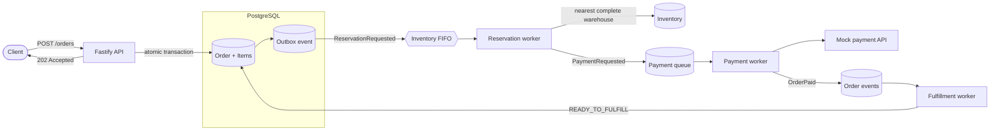
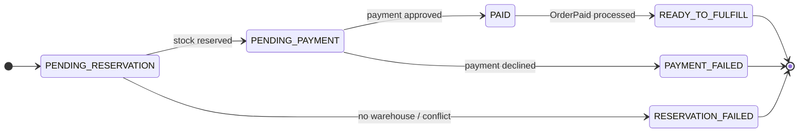

# Canals Order API

I built this service for the Canals backend assessment using Fastify, PostgreSQL/Prisma, and SQS through LocalStack.

## Architecture



I used hexagonal architecture for the project organization, separating the domain logic, application use cases, ports, and infrastructure adapters so the business rules remain independent from frameworks and external services.

## Main decisions

- I chose an asynchronous `POST /orders` flow. The API returns `202 PENDING_RESERVATION`, so slow payment or inventory contention does not block HTTP requests.
- I considered synchronous processing and distributed locks, but chose an outbox plus PostgreSQL `SERIALIZABLE` transactions. This keeps database state and events consistent without adding another locking system.
- Inventory uses FIFO messages grouped by product set. Events in one group stay ordered; unrelated groups run concurrently.
- Payment and fulfillment use Standard queues because their consumers are idempotent and can scale horizontally.
- The nearest warehouse is selected only when it can fulfill the complete order. Inventory is reserved, confirmed after payment, or released after failure.
- Idempotency keys prevent duplicate orders and duplicate charges. Duplicate `OrderPaid` messages are protected by inbox records.
- For the assessment, I persist the original card number because the specification requires sending it to the mock provider. In production I would use provider tokenization or a PCI-scoped vault.
- I use a deterministic mock geocoder so tests do not depend on an external API.

## Order states



## Run locally

```bash
docker compose up --build
npm run prepare:data
```

The API runs at `http://localhost:3000`.

Run a concurrent bulk load:

```powershell
$env:BULK_REQUESTS='190'
$env:BULK_CONCURRENCY='190'
$env:BULK_TIMEOUT_MS='30000'
npm run test:bulk
```

Create an order:

```bash
curl -X POST http://localhost:3000/orders \
  -H "content-type: application/json" \
  -H "Idempotency-Key: demo-order-001" \
  -d '{
    "customerId":"00000000-0000-4000-8000-000000000001",
    "shippingAddress":{"line1":"Calle 1","city":"Bogota","region":"Bogota","postalCode":"110111","country":"CO"},
    "items":[{"productId":"00000000-0000-4000-8000-000000000101","quantity":2}],
    "payment":{"creditCardNumber":"4242424242424242"}
  }'
```

Then query the order using the returned ID:

```bash
curl http://localhost:3000/orders/ORDER_UUID
```

Swagger UI: `http://localhost:3000/docs/`  
Readiness: `http://localhost:3000/status`  
OpenAPI: `http://localhost:3000/openapi.json`

Cards ending in `0000` are declined by the local payment mock.

## Verification

```bash
npm run test:api
npm run test:bulk
npm run typecheck
npm test
npm run build
npx prisma validate
```

The bulk script varies products, quantities, destinations, and planned declines. Configure it in PowerShell or in the bulk script:

```powershell
$env:BULK_REQUESTS='190'
$env:BULK_CONCURRENCY='190'
$env:BULK_TIMEOUT_MS='30000'
$env:BULK_DECLINE_EVERY='20'
npm run test:bulk
```

Queue logs:

```powershell
docker compose logs -f localstack outbox-publisher reservation-worker payment-worker fulfillment-worker
```

## Results


### Bulk-load reference

I ran the bulk script five times with 190 requests, concurrency 190, and a 30-second timeout. Every run returned `202` with no network or server errors. The arithmetic mean of those runs was:

| Metric | Mean |
| --- | ---: |
| Throughput | 109.61 requests/s |
| Average latency | 1,649 ms |
| p50 latency | 1,686 ms |
| p95 latency | 1,742 ms |
| p99 latency | 1,749 ms |

These numbers are a local reference under that exact load under my personal computer features.

## Project structure

```text
src/domain          Business rules
src/application     Use cases and ports
src/infrastructure  Prisma, SQS, geocoder, payment adapters
src/api             Fastify routes and schemas
src/processes       Worker composition and lifecycle
```
